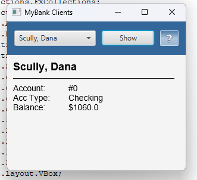
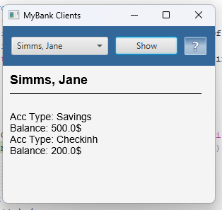

# Lab 5
# Створення GUI з допомогою JavaFX 

Мета роботи - навчитись створювати прості графічні інтерфейси з допомогою [JavaFX](https://openjfx.io/). 

## На "трійку" 
1. Завантажте jar-файл з усіма потрібними классами (*Bank, Customer, Account* та ін.) з наших попередніх лаб - [MyBank](https://github.com/ppc-ntu-khpi/GUI-Lab3-Starter/blob/master/jars/MyBank.jar) 
2. Створіть в Netbeans новий проект з назвою FxDemo (або використайте проект, створений в ході виконання попередньої роботи). *УВАГА! Чекбокс *Create Main Class* треба **очистити** (**не створювати виконуваний клас**)!* 
3. Додайте до проекту завантажену вами бібліотеку - правою кнопкой на проекті, обрати *Properties*, потім у дереві категорій обрати *Libraries* (другий пункт зверху), натиснути у правій частині вікна кнопку *Add JAR/Folder*, обрати jar-файл, завантажений у п. 1, натиснути *Ok* 
4. Додайте до проекту клас [FXDemo](https://github.com/ppc-ntu-khpi/GUI-Lab3-Starter/blob/master/Lab%205%20-%20JavaFX/FXDemo.java) з цього репозитрію.
5. Вивчіть вихідний код класу, впевніться, що ви розумієте як він має працювати 
6. Запустіть проект у звичайний спосіб. Ви маєте побачити вікно, в якому можна обрати клієнта і переглянути баланс його першого рахунку та переглянути інформацію про програму. Продемонстрируйте результат викладачеві. 

Результат

## На "чотири"
1. Доповніть код таким чином, щоб з файлу **test.dat** (робота номер 8, [файл даних](https://github.com/ppc-ntu-khpi/GUI-Lab3-Starter/tree/master/data) також є в цьому ж репозиторію) читалась інформація про клієнтів банку та їх рахунки 
2. Напишіть обробники подій для елементів керування, завдяки яким би при виборі клієнта та натисненні кнопки **Show** виводилась інформація про нього та всі його рахунки
3. Запустіть проект, впевніться, що все працює як очікувалось. Продемонстрируйте результат викладачеві.

Результат

